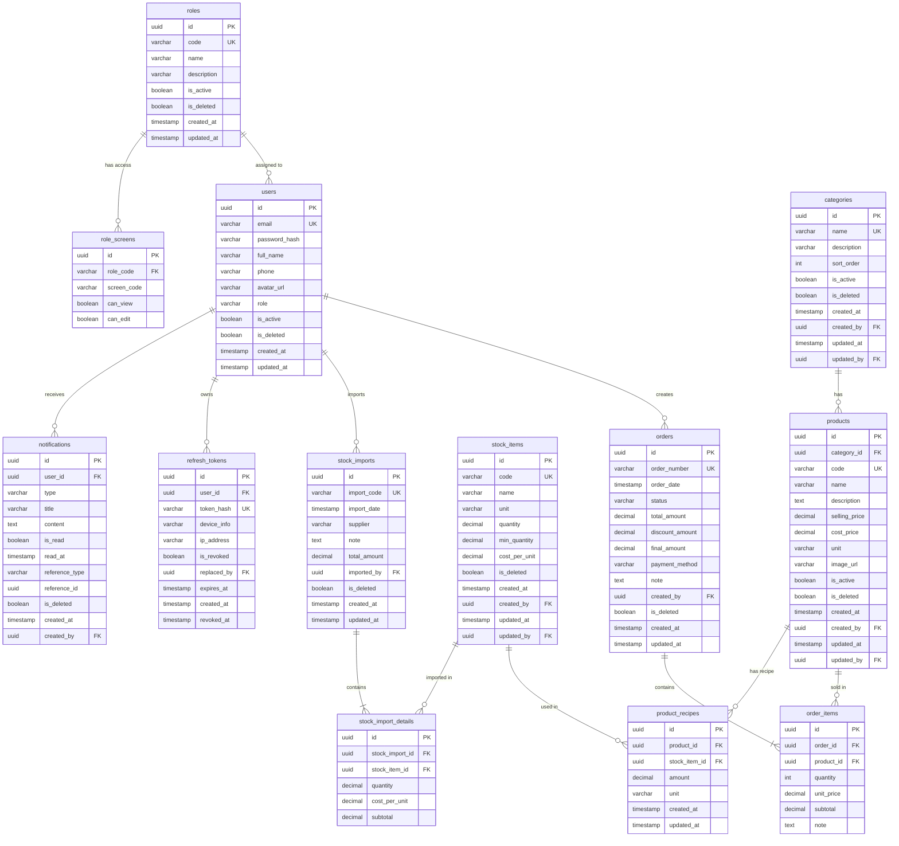
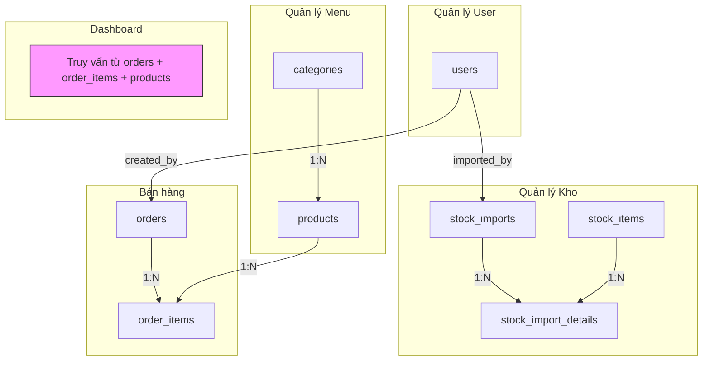
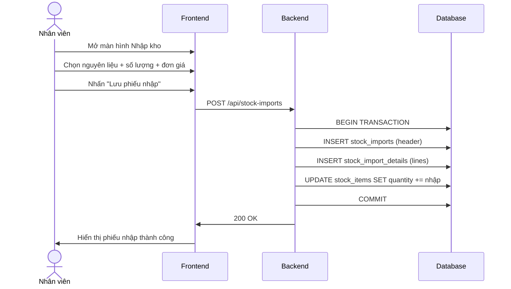
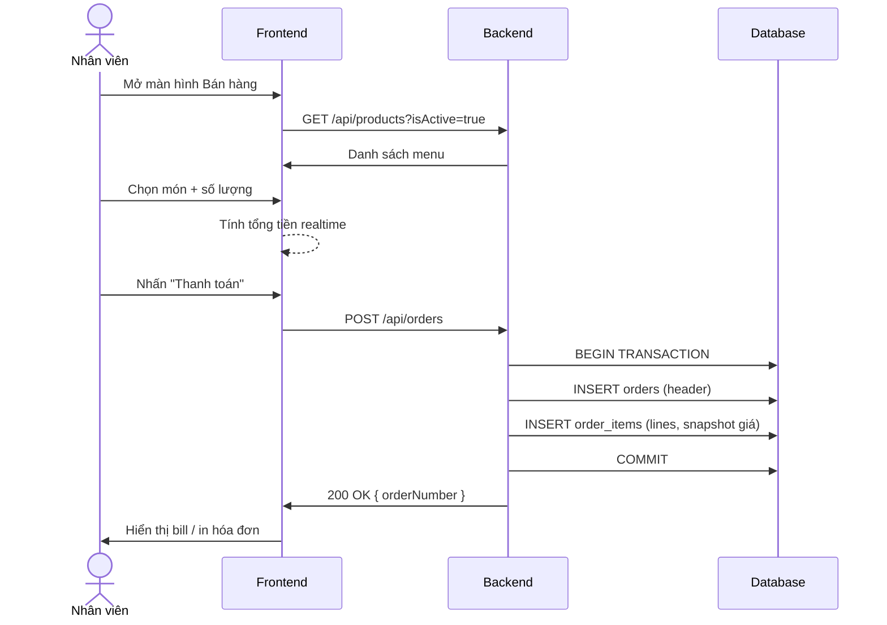

# Database Design v1.0 — Coffee Shop Management

| Hạng mục  | Nội dung                      |
| :-------- | :---------------------------- |
| Hệ thống  | Coffee Shop Management System |
| Phiên bản | 1.0                           |
| Ngày tạo  | 2026-08-26                    |
| Database  | PostgreSQL 16                 |
| ORM       | Sequelize 6                   |

### Lịch sử phiên bản

| Ver | Ngày       | Nội dung thay đổi                                                                                                      | Người thực hiện |
| :-: | :--------- | :--------------------------------------------------------------------------------------------------------------------- | :-------------- |
| 1.0 | 2026-08-26 | Tạo mới — 8 bảng (users, categories, products, stock_items, stock_imports, stock_import_details, orders, order_items)  | KhoaNA15        |
| 1.1 | 2026-08-26 | Thêm viewer role, bổ sung audit columns cho các bảng thiếu, thêm bảng refresh_tokens                                   | KhoaNA15        |
| 1.2 | 2026-08-26 | Thêm 4 bảng: refresh_tokens, roles, role_screens, notifications                                                        | KhoaNA15        |
| 1.3 | 2026-08-29 | Tối ưu 100% UI: Bổ sung avatar_url cho users, cost_price cho products, bổ sung bảng product_recipes (BOM định mức NVL) | Sky Agent       |

---

## 1. Phân tích nghiệp vụ → Bảng dữ liệu

| Màn hình            | Nghiệp vụ                               | Bảng liên quan                                         |
| :------------------ | :-------------------------------------- | :----------------------------------------------------- |
| Quản lý User        | CRUD tài khoản nhân viên/admin, avatar  | `users`, `roles`                                       |
| Phân quyền màn hình | Role nào được vào màn hình nào          | `roles`, `role_screens`                                |
| Quản lý sản phẩm    | Nhập menu, giá bán, Cost NVL & Định mức | `categories`, `products`, `product_recipes`            |
| Quản lý kho         | Nhập kho nguyên liệu, theo dõi tồn kho  | `stock_items`, `stock_imports`, `stock_import_details` |
| Bán hàng trong ngày | Tạo đơn, ghi nhận từng ly bán           | `orders`, `order_items`                                |
| Dashboard           | Thống kê doanh số, top sản phẩm         | Truy vấn từ `orders`, `order_items`, `products`        |
| Xác thực            | Quản lý token đăng nhập                 | `refresh_tokens`                                       |
| Thông báo           | Gửi/hiển thị notification               | `notifications`                                        |

---

## 2. ERD — Entity Relationship Diagram



---

## 3. Chi tiết từng bảng

### 3.1. `users` — Quản lý người dùng

| Cột             | Kiểu         | Null | Default            | Mô tả                                                                |
| :-------------- | :----------- | :--: | :----------------- | :------------------------------------------------------------------- |
| `id`            | UUID         |  NO  | uuid_generate_v4() | PK                                                                   |
| `email`         | VARCHAR(100) |  NO  |                    | Email đăng nhập (unique)                                             |
| `password_hash` | VARCHAR(255) |  NO  |                    | Mật khẩu đã hash (bcrypt)                                            |
| `full_name`     | VARCHAR(100) |  NO  |                    | Họ tên                                                               |
| `phone`         | VARCHAR(20)  | YES  |                    | Số điện thoại                                                        |
| `avatar_url`    | VARCHAR(500) | YES  |                    | URL ảnh đại diện nhân viên (hiển thị UI Header & UserList)           |
| `role`          | VARCHAR(20)  |  NO  | `'staff'`          | `admin` / `manager` / `staff` / `viewer` — FK logic tới `roles.code` |
| `is_active`     | BOOLEAN      |  NO  | `true`             | Trạng thái hoạt động                                                 |
| `is_deleted`    | BOOLEAN      |  NO  | `false`            | Soft delete                                                          |
| `created_at`    | TIMESTAMPTZ  |  NO  | NOW()              |                                                                      |
| `updated_at`    | TIMESTAMPTZ  |  NO  | NOW()              |                                                                      |

**Index:**

- `uq_users_email` — UNIQUE on `email`

---

### 3.2. `categories` — Danh mục sản phẩm

Ví dụ: Cà phê, Trà, Sinh tố, Nước ép, Topping...

| Cột           | Kiểu         | Null | Default            | Mô tả                       |
| :------------ | :----------- | :--: | :----------------- | :-------------------------- |
| `id`          | UUID         |  NO  | uuid_generate_v4() | PK                          |
| `name`        | VARCHAR(100) |  NO  |                    | Tên danh mục (unique)       |
| `description` | VARCHAR(255) | YES  |                    | Mô tả                       |
| `sort_order`  | INTEGER      |  NO  | `0`                | Thứ tự hiển thị             |
| `is_active`   | BOOLEAN      |  NO  | `true`             | Có hiển thị trên menu không |
| `is_deleted`  | BOOLEAN      |  NO  | `false`            |                             |
| `created_at`  | TIMESTAMPTZ  |  NO  | NOW()              |                             |
| `created_by`  | UUID         | YES  |                    | FK → `users.id`             |
| `updated_at`  | TIMESTAMPTZ  |  NO  | NOW()              |                             |
| `updated_by`  | UUID         | YES  |                    | FK → `users.id`             |

**Index:**

- `uq_categories_name` — UNIQUE on `name`

**Dữ liệu mẫu:**
| name | sort_order |
| :--- | :---: |
| Cà phê | 1 |
| Trà | 2 |
| Sinh tố | 3 |
| Nước ép | 4 |
| Đá xay | 5 |
| Topping | 6 |

---

### 3.3. `products` — Sản phẩm (Menu bán)

Ví dụ: Cà phê sữa, Cà phê đen, Trà đào cam sả...

| Cột | Kiểu | Null | Default | Mô tả |
| :--- | :--- | :---: | :--- | :--- |
| `id` | UUID | NO | uuid_generate_v4() | PK |
| `category_id` | UUID | NO | | FK → `categories.id` |
| `code` | VARCHAR(20) | NO | | Mã sản phẩm (unique). VD: `CF001` |
| `name` | VARCHAR(200) | NO | | Tên sản phẩm |
| `description` | TEXT | YES | | Mô tả chi tiết |
| `selling_price` | DECIMAL(12,0) | NO | | Giá bán (VNĐ, không lẻ) |
| `cost_price` | DECIMAL(12,0) | YES | `0` | Giá vốn định mức tham khảo / Cost NVL |
| `unit` | VARCHAR(20) | NO | `'ly'` | Đơn vị: `ly`, `chai`, `phần` |
| `image_url` | VARCHAR(500) | YES | | Ảnh sản phẩm |
| `is_active` | BOOLEAN | NO | `true` | Còn bán trên menu |
| `is_deleted` | BOOLEAN | NO | `false` | |
| `created_at` | TIMESTAMPTZ | NO | NOW() | |
| `created_by` | UUID | YES | | FK → `users.id` |
| `updated_at` | TIMESTAMPTZ | NO | NOW() | |
| `updated_by` | UUID | YES | | FK → `users.id` |

**Index:**

- `uq_products_code` — UNIQUE on `code`
- `idx_products_category_id` — on `category_id`
- `idx_products_is_active` — on `is_active, is_deleted`

**Dữ liệu mẫu:**
| code | name | category | selling_price | cost_price | unit |
| :--- | :--- | :--- | ---: | ---: | :--- |
| CF001 | Cà phê sữa đá | Cà phê | 29,000 | 8,500 | ly |
| CF002 | Cà phê đen đá | Cà phê | 25,000 | 7,000 | ly |
| CF003 | Bạc xỉu | Cà phê | 29,000 | 9,800 | ly |
| TR001 | Trà đào cam sả | Trà | 35,000 | 12,000 | ly |
| TR002 | Trà vải | Trà | 35,000 | | ly |
| ST001 | Sinh tố bơ | Sinh tố | 39,000 | | ly |

---

### 3.3.1. `product_recipes` — Định mức nguyên liệu (BOM Recipe)

Mỗi dòng đại diện cho 1 nguyên liệu kho tham gia cấu thành 1 sản phẩm bán (dùng để tính Cost NVL và tự động trừ kho khi bán hàng trên POS).

| Cột                             | Kiểu        | Null | Default        | Mô tả                                                                      |
| :------------------------------ | :---------- | :--: | :------------- | :------------------------------------------------------------------------- |
| `id`                            | INTEGER     |  NO  | Auto Increment | PK                                                                         |
| `productId` / `product_id`      | INTEGER     |  NO  |                | FK → `products.id`                                                         |
| `stockItemId` / `stock_item_id` | INTEGER     |  NO  |                | FK → `stock_items.id`                                                      |
| `amount`                        | DOUBLE      | YES  | `1.0`          | Định lượng nguyên liệu cho 1 sản phẩm                                      |
| `unit`                          | VARCHAR(20) |  NO  | `'g'` / `'ml'` | Đơn vị tính định mức nguyên liệu                                           |
| `created_at` / `createdAt`      | TIMESTAMPTZ |  NO  | NOW()          |                                                                            |
| `updated_at` / `updatedAt`      | TIMESTAMPTZ |  NO  | NOW()          |                                                                            |

**Index & Migration Notes:**

- `idx_product_recipes_product_id` — on `productId`
- `idx_product_recipes_stock_item_id` — on `stockItemId`
- **DDL Migration & PostgreSQL Sequences**: Tự động gọi `ALTER TABLE product_recipes ALTER COLUMN "quantityNeeded" DROP NOT NULL;` và `syncAllPostgresSequences()` khi khởi động server để đảm bảo không bị xung đột ràng buộc Not Null.

---

### 3.4. `stock_items` — Nguyên liệu kho

Ví dụ: Cà phê hạt, Sữa đặc, Đường, Đào lon, Trân châu...

| Cột | Kiểu | Null | Default | Mô tả |
| :--- | :--- | :---: | :--- | :--- |
| `id` | INTEGER / SERIAL | NO | auto_increment | PK |
| `code` | VARCHAR(50) | NO | | Mã nguyên liệu (unique) |
| `name` | VARCHAR(200) | NO | | Tên nguyên liệu |
| `category` | VARCHAR(100) | NO | `'Cà phê hạt'` | Phân loại nguyên liệu kho |
| `unit` | VARCHAR(20) | NO | | Đơn vị tính kho chính (ví dụ: `kg`, `lít`, `lon`, `hộp`, `cái`) |
| `quantity` | DECIMAL(12,3) | NO | `0` | Số lượng tồn kho hiện tại (tính theo đơn vị `unit`) |
| `min_quantity` | DECIMAL(12,3) | NO | `0` | Mức tối thiểu (cảnh báo khi dưới mức này) |
| `cost_per_unit` | DECIMAL(12,0) | NO | `0` | Giá vốn đơn vị tính kho `unit` |
| `is_deleted` | BOOLEAN | NO | `false` | Đã xóa mềm |
| `created_at` | TIMESTAMPTZ | NO | NOW() | |
| `updated_at` | TIMESTAMPTZ | NO | NOW() | |

> **Lưu ý tối ưu Database (v1.4)**: Đã xóa 2 cột không còn sử dụng `purchase_unit` và `conversion_rate` trong bảng `stock_items` (và `quantity_needed` trong bảng `product_recipes`). Việc quy đổi đơn vị tính thể tích/khối lượng được xử lý động tức thì ở tầng công thức sản phẩm BOM (`unitConversion.ts`).

**Index:**

- `uq_stock_items_code` — UNIQUE on `code`

**Dữ liệu mẫu:**
| code | name | unit | min_quantity |
| :--- | :--- | :--- | ---: |
| NL001 | Cà phê hạt Robusta | kg | 5 |
| NL002 | Sữa đặc Ông Thọ | hộp | 20 |
| NL003 | Đường cát trắng | kg | 10 |
| NL004 | Sữa tươi TH | lít | 10 |
| NL005 | Đào lon | hộp | 10 |
| NL006 | Trân châu đen | kg | 3 |

---

### 3.5. `stock_imports` — Phiếu nhập kho (Header)

Mỗi lần nhập kho tạo 1 phiếu. Ghi nhận ngày giờ, ai nhập, nhà cung cấp.

| Cột | Kiểu | Null | Default | Mô tả |
| :--- | :--- | :---: | :--- | :--- |
| `id` | UUID | NO | uuid_generate_v4() | PK |
| `import_code` | VARCHAR(20) | NO | | Mã phiếu nhập (unique, auto-gen). VD: `NK20260826-001` |
| `import_date` | TIMESTAMPTZ | NO | NOW() | Ngày giờ nhập kho |
| `supplier` | VARCHAR(200) | YES | | Nhà cung cấp |
| `note` | TEXT | YES | | Ghi chú |
| `total_amount` | DECIMAL(15,0) | NO | `0` | Tổng tiền nhập = SUM(details.subtotal) |
| `imported_by` | UUID | NO | | FK → `users.id` — Người thực hiện nhập |
| `is_deleted` | BOOLEAN | NO | `false` | |
| `created_at` | TIMESTAMPTZ | NO | NOW() | |
| `created_by` | UUID | YES | | FK → `users.id` |
| `updated_at` | TIMESTAMPTZ | NO | NOW() | |
| `updated_by` | UUID | YES | | FK → `users.id` |

**Index:**

- `uq_stock_imports_code` — UNIQUE on `import_code`
- `idx_stock_imports_date` — on `import_date`
- `idx_stock_imports_imported_by` — on `imported_by`

---

### 3.6. `stock_import_details` — Chi tiết phiếu nhập kho (Lines)

Mỗi dòng = 1 nguyên liệu trong phiếu nhập.

| Cột | Kiểu | Null | Default | Mô tả |
| :--- | :--- | :---: | :--- | :--- |
| `id` | UUID | NO | uuid_generate_v4() | PK |
| `stock_import_id` | UUID | NO | | FK → `stock_imports.id` |
| `stock_item_id` | UUID | NO | | FK → `stock_items.id` |
| `quantity` | DECIMAL(12,3) | NO | | Số lượng nhập |
| `cost_per_unit` | DECIMAL(12,0) | NO | | Đơn giá nhập |
| `subtotal` | DECIMAL(15,0) | NO | | = quantity × cost_per_unit |
| `created_at` | TIMESTAMPTZ | NO | NOW() | |

**Index:**

- `idx_import_details_import_id` — on `stock_import_id`
- `idx_import_details_item_id` — on `stock_item_id`

**Trigger/Logic:** Khi tạo `stock_import_details` → tự động cộng `quantity` vào `stock_items.quantity`.

---

### 3.7. `orders` — Đơn hàng bán (Header)

Mỗi đơn = 1 lượt khách mua / 1 bill.

| Cột | Kiểu | Null | Default | Mô tả |
| :--- | :--- | :---: | :--- | :--- |
| `id` | UUID | NO | uuid_generate_v4() | PK |
| `order_number` | VARCHAR(20) | NO | | Số đơn (unique, auto-gen). VD: `DH20260826-001` |
| `order_date` | TIMESTAMPTZ | NO | NOW() | Ngày giờ bán |
| `status` | VARCHAR(20) | NO | `'completed'` | `pending` / `completed` / `cancelled` |
| `total_amount` | DECIMAL(15,0) | NO | `0` | Tổng tiền trước giảm giá |
| `discount_amount` | DECIMAL(15,0) | NO | `0` | Số tiền giảm giá |
| `final_amount` | DECIMAL(15,0) | NO | `0` | Tiền thanh toán = total - discount |
| `payment_method` | VARCHAR(20) | NO | `'cash'` | `cash` / `transfer` / `card` |
| `note` | TEXT | YES | | Ghi chú |
| `created_by` | UUID | NO | | FK → `users.id` — Nhân viên bán |
| `is_deleted` | BOOLEAN | NO | `false` | |
| `created_at` | TIMESTAMPTZ | NO | NOW() | |
| `updated_at` | TIMESTAMPTZ | NO | NOW() | |
| `updated_by` | UUID | YES | | FK → `users.id` |

**Index:**

- `uq_orders_order_number` — UNIQUE on `order_number`
- `idx_orders_order_date` — on `order_date`
- `idx_orders_status` — on `status, is_deleted`
- `idx_orders_created_by` — on `created_by`

---

### 3.8. `order_items` — Chi tiết đơn hàng (Lines)

Mỗi dòng = 1 món trong bill. VD: 2 ly Cà phê sữa, 1 ly Trà đào.

| Cột | Kiểu | Null | Default | Mô tả |
| :--- | :--- | :---: | :--- | :--- |
| `id` | UUID | NO | uuid_generate_v4() | PK |
| `order_id` | UUID | NO | | FK → `orders.id` |
| `product_id` | UUID | NO | | FK → `products.id` |
| `quantity` | INTEGER | NO | | Số lượng ly/phần |
| `unit_price` | DECIMAL(12,0) | NO | | Giá tại thời điểm bán (snapshot từ products.selling_price) |
| `subtotal` | DECIMAL(15,0) | NO | | = quantity × unit_price |
| `note` | TEXT | YES | | Ghi chú (ít đường, thêm đá, ...) |
| `created_at` | TIMESTAMPTZ | NO | NOW() | |
| `updated_at` | TIMESTAMPTZ | NO | NOW() | |

**Index:**

- `idx_order_items_order_id` — on `order_id`
- `idx_order_items_product_id` — on `product_id`

> **Quan trọng:** `unit_price` là snapshot giá tại thời điểm bán, KHÔNG phải FK tham chiếu realtime. Nếu sau này sửa giá sản phẩm, các đơn hàng cũ vẫn giữ giá gốc.

---

### 3.9. `roles` — Bảng master quản lý Role

Lưu danh sách tất cả role trong hệ thống. Dùng để quản lý động (thêm/sửa role không cần sửa code).

| Cột | Kiểu | Null | Default | Mô tả |
| :--- | :--- | :---: | :--- | :--- |
| `id` | UUID | NO | uuid_generate_v4() | PK |
| `code` | VARCHAR(20) | NO | | Mã role (unique). VD: `admin`, `manager`, `staff`, `viewer` |
| `name` | VARCHAR(100) | NO | | Tên hiển thị. VD: "Quản trị viên", "Nhân viên" |
| `description` | VARCHAR(255) | YES | | Mô tả quyền hạn |
| `is_active` | BOOLEAN | NO | `true` | Role còn hoạt động |
| `is_deleted` | BOOLEAN | NO | `false` | |
| `created_at` | TIMESTAMPTZ | NO | NOW() | |
| `updated_at` | TIMESTAMPTZ | NO | NOW() | |

**Index:**

- `uq_roles_code` — UNIQUE on `code`

**Dữ liệu mẫu:**
| code | name | description |
| :--- | :--- | :--- |
| admin | Quản trị viên | Toàn quyền hệ thống |
| manager | Quản lý | Quản lý sản phẩm, kho, đơn hàng, xem báo cáo |
| staff | Nhân viên | Bán hàng, xem sản phẩm |
| viewer | Chỉ xem | Chỉ xem dữ liệu, không thao tác |

---

### 3.10. `role_screens` — Phân quyền role theo màn hình

Mỗi dòng = 1 role được phép truy cập 1 màn hình. Dùng cho cả BE (kiểm tra quyền API) và FE (ẩn/hiện menu).

| Cột | Kiểu | Null | Default | Mô tả |
| :--- | :--- | :---: | :--- | :--- |
| `id` | UUID | NO | uuid_generate_v4() | PK |
| `role_code` | VARCHAR(20) | NO | | FK logic → `roles.code` |
| `screen_code` | VARCHAR(50) | NO | | Mã màn hình. VD: `SC001_DASHBOARD`, `SC002_PRODUCT_LIST` |
| `can_view` | BOOLEAN | NO | `true` | Quyền xem |
| `can_edit` | BOOLEAN | NO | `false` | Quyền thêm/sửa/xóa |

**Index:**

- `uq_role_screens_role_screen` — UNIQUE on (`role_code`, `screen_code`)
- `idx_role_screens_role_code` — on `role_code`

**Dữ liệu mẫu:**
| role_code | screen_code | can_view | can_edit |
| :--- | :--- | :---: | :---: |
| admin | SC001_DASHBOARD | true | true |
| admin | SC002_PRODUCT_LIST | true | true |
| admin | SC003_PRODUCT_FORM | true | true |
| admin | SC004_STOCK_LIST | true | true |
| admin | SC005_STOCK_IMPORT | true | true |
| admin | SC006_ORDER_POS | true | true |
| admin | SC007_USER_MGMT | true | true |
| manager | SC001_DASHBOARD | true | true |
| manager | SC002_PRODUCT_LIST | true | true |
| manager | SC003_PRODUCT_FORM | true | true |
| manager | SC004_STOCK_LIST | true | true |
| manager | SC005_STOCK_IMPORT | true | true |
| manager | SC006_ORDER_POS | true | true |
| manager | SC007_USER_MGMT | false | false |
| staff | SC001_DASHBOARD | false | false |
| staff | SC002_PRODUCT_LIST | true | false |
| staff | SC004_STOCK_LIST | true | false |
| staff | SC006_ORDER_POS | true | true |
| viewer | SC001_DASHBOARD | true | false |
| viewer | SC002_PRODUCT_LIST | true | false |
| viewer | SC004_STOCK_LIST | true | false |

**Quy tắc:**
- Nếu không có record → role KHÔNG có quyền vào màn hình đó.
- `can_view = true, can_edit = false` → chỉ xem, ẩn các nút Thêm/Sửa/Xóa.
- `can_edit = true` bao hàm `can_view = true`.

---

### 3.11. `refresh_tokens` — Quản lý Token

Lưu refresh token đã hash. Hỗ trợ token rotation, reuse detection, multi-device.

| Cột | Kiểu | Null | Default | Mô tả |
| :--- | :--- | :---: | :--- | :--- |
| `id` | UUID | NO | uuid_generate_v4() | PK |
| `user_id` | UUID | NO | | FK → `users.id` |
| `token_hash` | VARCHAR(64) | NO | | SHA-256 hash của refresh token |
| `device_info` | VARCHAR(255) | YES | | User-Agent / thiết bị |
| `ip_address` | VARCHAR(45) | YES | | IP address (IPv4/IPv6) |
| `is_revoked` | BOOLEAN | NO | `false` | Đã bị thu hồi |
| `replaced_by` | UUID | YES | | FK → `refresh_tokens.id` — token thế chỗ (audit trail) |
| `expires_at` | TIMESTAMPTZ | NO | | Thời điểm hết hạn |
| `created_at` | TIMESTAMPTZ | NO | NOW() | |
| `revoked_at` | TIMESTAMPTZ | YES | | Thời điểm bị revoke |

**Index:**

- `uq_refresh_tokens_hash` — UNIQUE on `token_hash` (lookup nhanh)
- `idx_refresh_tokens_user_id` — on `user_id` (lấy tất cả tokens của user)
- `idx_refresh_tokens_expires_at` — on `expires_at` (cron cleanup)

**Quy tắc:**
- Token lưu dạng SHA-256 hash, **KHÔNG** lưu plaintext.
- Mỗi user tối đa 5 active tokens (multi-device).
- Khi refresh → token cũ bị revoke, gắn `replaced_by` = ID token mới.
- Nếu token đã revoke bị dùng lại → **revoke ALL** tokens của user (reuse detection).
- Cron job xóa token hết hạn + revoked > 30 ngày.

---

### 3.12. `notifications` — Thông báo

Lưu thông báo gửi đến user (cảnh báo tồn kho, đơn hàng mới, thông báo hệ thống...).

| Cột | Kiểu | Null | Default | Mô tả |
| :--- | :--- | :---: | :--- | :--- |
| `id` | UUID | NO | uuid_generate_v4() | PK |
| `user_id` | UUID | NO | | FK → `users.id` — Người nhận |
| `type` | VARCHAR(30) | NO | | Loại: `stock_alert`, `order_new`, `system`, `security` |
| `title` | VARCHAR(200) | NO | | Tiêu đề thông báo |
| `content` | TEXT | NO | | Nội dung chi tiết |
| `is_read` | BOOLEAN | NO | `false` | Đã đọc chưa |
| `read_at` | TIMESTAMPTZ | YES | | Thời điểm đọc |
| `reference_type` | VARCHAR(30) | YES | | Loại entity liên quan: `order`, `stock_import`, `user` |
| `reference_id` | UUID | YES | | ID entity liên quan (để navigate khi click) |
| `is_deleted` | BOOLEAN | NO | `false` | |
| `created_at` | TIMESTAMPTZ | NO | NOW() | |
| `created_by` | UUID | YES | | Người/hệ thống tạo thông báo |

**Index:**

- `idx_notifications_user_id` — on `user_id, is_read, is_deleted` (danh sách thông báo của user)
- `idx_notifications_created_at` — on `created_at` (sắp xếp mới nhất)

**Dữ liệu mẫu:**
| type | title | Khi nào tạo |
| :--- | :--- | :--- |
| `stock_alert` | "Cà phê hạt Robusta sắp hết" | Khi `stock_items.quantity ≤ min_quantity` |
| `order_new` | "Đơn hàng DH20260826-005 mới" | (Tuỳ chọn) Khi có đơn mới |
| `system` | "Hệ thống sẽ bảo trì lúc 2:00" | Admin gửi thông báo chung |
| `security` | "Phát hiện đăng nhập bất thường" | Khi reuse detection triggered |

**Quy tắc:**
- `reference_type` + `reference_id` cho phép FE navigate đến entity cụ thể khi user click vào thông báo.
- Notification `stock_alert` được tạo tự động bởi cron job hoặc trigger sau mỗi đơn hàng.
- Notification `security` được tạo bởi auth service khi phát hiện token reuse.

---

### 3.13. `product_recipes` — Định mức nguyên liệu (BOM / Công thức pha chế)

Định mức nguyên liệu tiêu hao cho từng sản phẩm. Giúp tự động tính toán Cost NVL 3D chính xác và trừ tồn kho tự động khi bán hàng.

| Cột | Kiểu | Null | Default | Mô tả |
| :--- | :--- | :---: | :--- | :--- |
| `id` | UUID | NO | uuid_generate_v4() | PK |
| `product_id` | UUID | NO | | FK → `products.id` |
| `stock_item_id` | UUID | NO | | FK → `stock_items.id` |
| `quantity_needed` | DECIMAL(12,3) | NO | | Số lượng tiêu hao cho 1 ly/phần. VD: `0.018` kg |
| `unit` | VARCHAR(20) | NO | | Đơn vị tiêu hao: `kg`, `lít`, `hộp`, `lon` |
| `created_at` | TIMESTAMPTZ | NO | NOW() | |
| `updated_at` | TIMESTAMPTZ | NO | NOW() | |

**Index:**

- `uq_product_recipes_prod_item` — UNIQUE on (`product_id`, `stock_item_id`)
- `idx_product_recipes_product_id` — on `product_id`

**Dữ liệu mẫu (Cho 1 ly Cà phê sữa đá CF001):**

| product_id | stock_item_id (Tên NL)     | quantity_needed | unit |
| :--------- | :------------------------- | --------------: | :--- |
| `CF001`    | NL001 (Cà phê hạt Robusta) |           0.018 | kg   |
| `CF001`    | NL002 (Sữa đặc Ông Thọ)    |           0.040 | hộp  |

---

## 4. Diagram quan hệ tổng quan



---

## 5. Dashboard — Các truy vấn thống kê

Dashboard không cần bảng riêng, truy vấn trực tiếp từ dữ liệu bán hàng.

### 5.1. Doanh thu hôm nay

```sql
SELECT
  COUNT(DISTINCT o.id) AS total_orders,
  SUM(o.final_amount) AS total_revenue,
  SUM(oi.quantity) AS total_cups_sold
FROM orders o
JOIN order_items oi ON o.id = oi.order_id
WHERE o.order_date::date = CURRENT_DATE
  AND o.status = 'completed'
  AND o.is_deleted = false;
```

### 5.2. Doanh thu theo ngày (chart)

```sql
SELECT
  o.order_date::date AS sale_date,
  SUM(o.final_amount) AS daily_revenue,
  COUNT(DISTINCT o.id) AS order_count
FROM orders o
WHERE o.order_date >= CURRENT_DATE - INTERVAL '30 days'
  AND o.status = 'completed'
  AND o.is_deleted = false
GROUP BY o.order_date::date
ORDER BY sale_date;
```

### 5.3. Top sản phẩm bán chạy

```sql
SELECT
  p.name AS product_name,
  c.name AS category_name,
  SUM(oi.quantity) AS total_sold,
  SUM(oi.subtotal) AS total_revenue
FROM order_items oi
JOIN products p ON oi.product_id = p.id
JOIN categories c ON p.category_id = c.id
JOIN orders o ON oi.order_id = o.id
WHERE o.order_date >= CURRENT_DATE - INTERVAL '30 days'
  AND o.status = 'completed'
  AND o.is_deleted = false
GROUP BY p.id, p.name, c.name
ORDER BY total_sold DESC
LIMIT 10;
```

### 5.4. Doanh thu theo danh mục

```sql
SELECT
  c.name AS category_name,
  SUM(oi.quantity) AS total_sold,
  SUM(oi.subtotal) AS total_revenue
FROM order_items oi
JOIN products p ON oi.product_id = p.id
JOIN categories c ON p.category_id = c.id
JOIN orders o ON oi.order_id = o.id
WHERE o.order_date::date = CURRENT_DATE
  AND o.status = 'completed'
  AND o.is_deleted = false
GROUP BY c.id, c.name
ORDER BY total_revenue DESC;
```

### 5.5. Cảnh báo tồn kho thấp

```sql
SELECT code, name, unit, quantity, min_quantity
FROM stock_items
WHERE quantity <= min_quantity
  AND is_deleted = false
ORDER BY (quantity / NULLIF(min_quantity, 0)) ASC;
```

---

## 6. Luồng nghiệp vụ chính

### 6.1. Luồng nhập kho



### 6.2. Luồng bán hàng



---

## 7. Migration Script (Sequelize)

Thứ tự chạy migration:

| # | Migration | Phụ thuộc |
| :-: | :--- | :--- |
| 1 | `create-users` | — |
| 2 | `create-categories` | users |
| 3 | `create-products` | categories, users |
| 4 | `create-stock-items` | users |
| 5 | `create-stock-imports` | users |
| 6 | `create-stock-import-details` | stock_imports, stock_items |
| 7 | `create-orders` | users |
| 8 | `create-order-items` | orders, products |
| 9 | `create-roles` | — |
| 10 | `create-role-screens` | roles |
| 11 | `create-refresh-tokens` | users |
| 12 | `create-notifications` | users |
| 13 | `create-product-recipes` | products, stock_items |

---

## 8. Tổng kết

| Bảng                   |   Số cột    | Phục vụ màn hình            |
| :--------------------- | :---------: | :-------------------------- |
| `users`                |     11      | Quản lý User (kèm avatar)   |
| `roles`                |      8      | Phân quyền                  |
| `role_screens`         |      5      | Phân quyền màn hình         |
| `categories`           |     10      | Quản lý sản phẩm            |
| `products`             |     15      | Quản lý sản phẩm, Bán hàng  |
| `stock_items`          |     12      | Quản lý kho                 |
| `stock_imports`        |     12      | Quản lý kho (phiếu nhập)    |
| `stock_import_details` |      7      | Quản lý kho (chi tiết nhập) |
| `orders`               |     14      | Bán hàng, Dashboard         |
| `order_items`          |      8      | Bán hàng, Dashboard         |
| `refresh_tokens`       |     10      | Xác thực                    |
| `notifications`        |     12      | Thông báo                   |
| `product_recipes`      |      7      | Định mức NVL (BOM), POS     |
| **Tổng: 13 bảng**      | **131 cột** |                             |
