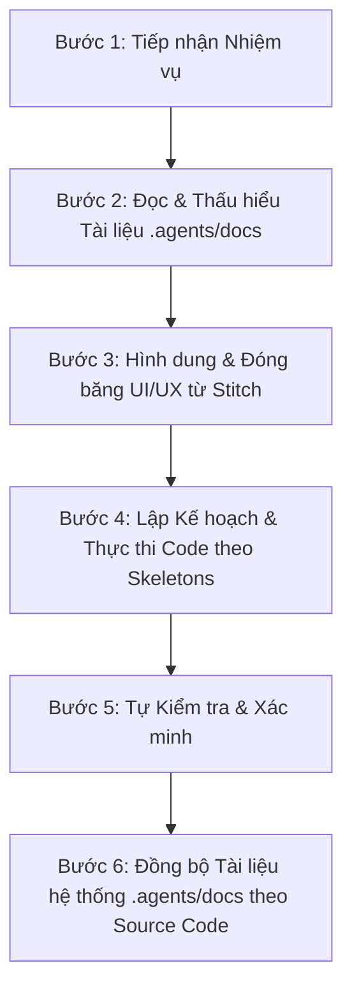

# Workflow 1: Implement (Phát triển Chức năng)

Workflow này quy định các bước bắt buộc agent/developer phải thực hiện khi nhận một nhiệm vụ phát triển (feature, bugfix, refactor) trong dự án **Sky Coffee Management**.

> [!IMPORTANT]
> **TÔN CHỈ:** Tuyệt đối KHÔNG được viết code hoặc sửa đổi dự án khi chưa đọc tài liệu hướng dẫn nghiệp vụ và thiết kế UI liên quan tại `.agents/docs/`. Việc làm mù mù mờ mờ sẽ dẫn đến sai lệch nghiệp vụ và vi phạm convention.

---

## 📌 Quy trình 6 bước Thực hiện (Implementation Workflow)

---

## Bước 1: Tiếp nhận Nhiệm vụ & Xác định Phạm vi

- Xác định rõ nhiệm vụ thuộc phần nào: **Frontend**, **Backend**, **Database**, hay **Fullstack**.
- Tra cứu Màn hình (Screen ID, ví dụ `SC001` - `SC010`) hoặc API Endpoint liên quan.

---

## Bước 2: Đọc & Thấu hiểu Tài liệu `.agents/docs/`

Trước khi gõ bất kỳ dòng code nào, phải tra cứu và đọc kĩ các tài liệu tương ứng trong [`.agents/docs/`](file:///Users/apple/Desktop/SKY/sky/.agents/docs):

| Hạng mục Nhiệm vụ         | Tài liệu bắt buộc phải đọc                                                                                                                                                                                             | Nội dung cần nắm vững                                                  |
| :------------------------ | :--------------------------------------------------------------------------------------------------------------------------------------------------------------------------------------------------------------------- | :--------------------------------------------------------------------- |
| **Kiến trúc & Cấu trúc**  | [05_Project_Structure.md](file:///Users/apple/Desktop/SKY/sky/.agents/docs/05_Project_Structure.md)                                                                                                                    | Phân tầng Route -> Controller -> Service -> Model                      |
| **Giao diện FE (UI/UX)**  | [18_Stitch_UI_Prompts.md](file:///Users/apple/Desktop/SKY/sky/.agents/docs/18_Stitch_UI_Prompts.md) [20_Screen_Docs_SC001_SC010.md](file:///Users/apple/Desktop/SKY/sky/.agents/docs/20_Screen_Docs_SC001_SC010.md) | Mẫu layout, màu sắc, font, tương tác màn hình từ Stitch                |
| **Khuôn mẫu Code FE**     | [15_FE_Skeleton_Templates.md](file:///Users/apple/Desktop/SKY/sky/.agents/docs/15_FE_Skeleton_Templates.md)                                                                                                            | Template cho Component, Page, Custom Hook, API Call                    |
| **Khuôn mẫu Code BE**     | [16_BE_Skeleton_Templates.md](file:///Users/apple/Desktop/SKY/sky/.agents/docs/16_BE_Skeleton_Templates.md)                                                                                                            | Template cho Controller, Service, Model, Route, Middleware             |
| **Chuẩn API Response**    | [01_API_Response_Standard.md](file:///Users/apple/Desktop/SKY/sky/.agents/docs/01_API_Response_Standard.md)                                                                                                            | Envelop format `success(res, data)`, HTTP Status Code                  |
| **Xử lý Lỗi API**         | [02_API_Error_Handling.md](file:///Users/apple/Desktop/SKY/sky/.agents/docs/02_API_Error_Handling.md)                                                                                                                  | Mã lỗi chuẩn, format lỗi 400 validation, body rỗng cho 401/403/404/500 |
| **Validation Input**      | [03_Common_Validation.md](file:///Users/apple/Desktop/SKY/sky/.agents/docs/03_Common_Validation.md)                                                                                                                    | Schema Joi/Zod, rule validate email, phone, number                     |
| **Phân trang & Sắp xếp**  | [04_Sort_And_Paging.md](file:///Users/apple/Desktop/SKY/sky/.agents/docs/04_Sort_And_Paging.md)                                                                                                                        | Cấu trúc param `page`, `limit`, `sortBy`, `sortOrder`                  |
| **Cơ sở Dữ liệu**         | [14_Database_Design_v1.md](file:///Users/apple/Desktop/SKY/sky/.agents/docs/14_Database_Design_v1.md) [08_Database_Convention.md](file:///Users/apple/Desktop/SKY/sky/.agents/docs/08_Database_Convention.md)       | Schema bảng, tên cột snake_case, khoá ngoại, index                     |
| **Xác thực & Phân quyền** | [07_Authentication_Authorization.md](file:///Users/apple/Desktop/SKY/sky/.agents/docs/07_Authentication_Authorization.md)                                                                                              | JWT token, Middleware authorize role                                   |
| **Hằng số & Config**      | [17_Shared_Constants_Configs.md](file:///Users/apple/Desktop/SKY/sky/.agents/docs/17_Shared_Constants_Configs.md)                                                                                                      | Enum trạng thái, Role ID, Status Code                                  |

---

## Bước 3: Hình dung & Đóng băng UI Thiết kế từ Stitch

1. Tra cứu Stitch Prompts trong [18_Stitch_UI_Prompts.md](file:///Users/apple/Desktop/SKY/sky/.agents/docs/18_Stitch_UI_Prompts.md).
2. Nếu làm việc với các màn hình từ SC001 đến SC010, đọc kĩ mô tả luồng giao diện trong [20_Screen_Docs_SC001_SC010.md](file:///Users/apple/Desktop/SKY/sky/.agents/docs/20_Screen_Docs_SC001_SC010.md).
3. Đảm bảo nắm rõ:
   - Layout tổng thể (Sidebar 240px `#3E2723`, Header 64px, Content `#F5F5F5`).
   - Bảng màu: Primary `#5D4037`, Accent `#FF9800`, Success `#4CAF50`, Error `#F44336`.
   - Vị trí nút bấm, bảng dữ liệu, form nhập liệu, modal và notification status.

---

## Bước 4: Thực thi Code (Coding & Implementation)

Tuân thủ nghiêm ngặt Quy tắc Coding Convention:

1. **Tuân thủ Skeletons**: Sử dụng đúng skeleton template tại [15_FE_Skeleton_Templates.md](file:///Users/apple/Desktop/SKY/sky/.agents/docs/15_FE_Skeleton_Templates.md) và [16_BE_Skeleton_Templates.md](file:///Users/apple/Desktop/SKY/sky/.agents/docs/16_BE_Skeleton_Templates.md).
2. **Phân tầng Backend**:
   - `Route`: Khai báo đường dẫn + gán middleware validation & authorization.
   - `Controller`: Chỉ nhận `req`, gọi `Service`, và trả về `success(res, data)`. KHÔNG chứa business logic.
   - `Service`: Chứa toàn bộ business logic. KHÔNG đụng tới `req` hay `res`.
   - `Model`: Định nghĩa schema & query DB.
3. **Phân tầng Frontend**:
   - Giữ component gọn gàng, tách biệt state UI và logic call API via Custom Hooks/Services.
   - Dùng đúng hệ màu và thiết kế đã quy định.
4. **Naming Convention**: Theo quy định tại [06_Coding_Convention.md](file:///Users/apple/Desktop/SKY/sky/.agents/docs/06_Coding_Convention.md).

---

## Bước 5: Tự Kiểm tra & Xác minh (Self-Verification)

- Chạy ứng dụng dev server (`npm run dev` / `npm run start`) để verify trực tiếp.
- Đảm bảo không phát sinh lỗi syntax, lint error hoặc runtime error trên console.

---

## Bước 6: Đồng bộ Tài liệu Hệ thống (`.agents/docs/`) theo Source Code

- **Bắt buộc cập nhật tài liệu:** Khi thực hiện sửa đổi source code (BE, FE, Database Schema, API Specification, Validation Rules, UI Interaction, Constants/Configs) mà có điểm khác biệt hoặc bổ sung so với tài liệu hiện tại trong [`.agents/docs/`](file:///Users/apple/Desktop/SKY/sky/.agents/docs), agent/developer **BẮT BUỘC** phải cập nhật lại trực tiếp các file tài liệu tương ứng tại `.agents/docs/`.
  - **Cơ sở dữ liệu**: Sửa/thêm cột, bảng, khóa ngoại -> Cập nhật [14_Database_Design_v1.md](file:///Users/apple/Desktop/SKY/sky/.agents/docs/14_Database_Design_v1.md).
  - **Màn hình & Luồng UI**: Sửa đổi nút bấm, modal, luồng tương tác -> Cập nhật [20_Screen_Docs_SC001_SC010.md](file:///Users/apple/Desktop/SKY/sky/.agents/docs/20_Screen_Docs_SC001_SC010.md) & [18_Stitch_UI_Prompts.md](file:///Users/apple/Desktop/SKY/sky/.agents/docs/18_Stitch_UI_Prompts.md).
  - **Hằng số & Config**: Bổ sung enum, master code -> Cập nhật [17_Shared_Constants_Configs.md](file:///Users/apple/Desktop/SKY/sky/.agents/docs/17_Shared_Constants_Configs.md).
  - **API Spec & Validation**: Thay đổi params, response envelope, rules -> Cập nhật [01_API_Response_Standard.md](file:///Users/apple/Desktop/SKY/sky/.agents/docs/01_API_Response_Standard.md), [02_API_Error_Handling.md](file:///Users/apple/Desktop/SKY/sky/.agents/docs/02_API_Error_Handling.md) & [03_Common_Validation.md](file:///Users/apple/Desktop/SKY/sky/.agents/docs/03_Common_Validation.md).
- **Mục đích:** Đảm bảo toàn bộ tài liệu hệ thống luôn đồng nhất 100% với source code thực tế tại mọi thời điểm.
- Chuẩn bị sẵn sàng cho **Workflow 2: Review**.
