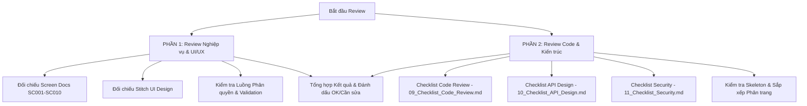

# Workflow 2: Review (Kiểm tra & Đánh giá Code & Nghiệp vụ)

Workflow này dùng để kiểm tra lại toàn bộ kết quả đã thực hiện ở **Workflow 1: Implement**. Đảm bảo code đạt chất lượng cao, đúng nghiệp vụ, tuân thủ kiến trúc và an toàn bảo mật.

> [!IMPORTANT]
> **TÔN CHỈ:** Review không chỉ dừng lại ở việc code có chạy được hay không, mà phải đánh giá toàn diện cả 2 mặt: **Nghiệp vụ (Business Logic)** và **Chất lượng Code (Code Quality & Security)** dựa trên các file checklist chuẩn tại `.agents/docs/`.

---

## 🔍 Quy trình Review 2 Lớp (Dual-Layer Review Process)



---

## PHẦN 1: Review Nghiệp vụ & Giao diện (Business & UI/UX Review)

Kiểm tra xem tính năng làm ra có đáp ứng đúng yêu cầu của hệ thống quản lý quán coffee hay không:

| Tiêu chí                   | File tài liệu tham chiếu                                                                                                                                                                                     | Các điểm bắt buộc phải verify                                                                                                                         |
| :------------------------- | :----------------------------------------------------------------------------------------------------------------------------------------------------------------------------------------------------------- | :---------------------------------------------------------------------------------------------------------------------------------------------------- |
| **Mô tả Màn hình & Luồng** | [20_Screen_Docs_SC001_SC010.md](file:///Users/apple/Desktop/SKY/sky/.agents/docs/20_Screen_Docs_SC001_SC010.md)                                                                                              | - Chức năng thực hiện đúng mô tả màn hình (`SC001` - `SC010`).<br>- Đúng các nút bấm, sự kiện chuyển trang và hành vi UI.                             |
| **Khớp Giao diện Stitch**  | [18_Stitch_UI_Prompts.md](file:///Users/apple/Desktop/SKY/sky/.agents/docs/18_Stitch_UI_Prompts.md)                                                                                                          | - Layout Sidebar 240px, Header 64px, Content `#F5F5F5`.<br>- Bảng màu chuẩn: Primary `#5D4037`, Accent `#FF9800`, Success `#4CAF50`, Error `#F44336`. |
| **Bảo mật & Phân quyền**   | [07_Authentication_Authorization.md](file:///Users/apple/Desktop/SKY/sky/.agents/docs/07_Authentication_Authorization.md)                                                                                    | - Người dùng không đúng Role bị chặn (Admin vs Manager vs Staff).<br>- Token JWT được gửi kèm và validate chính xác.                                  |
| **Thông báo & Lỗi UI**     | [02_API_Error_Handling.md](file:///Users/apple/Desktop/SKY/sky/.agents/docs/02_API_Error_Handling.md)<br>[03_Common_Validation.md](file:///Users/apple/Desktop/SKY/sky/.agents/docs/03_Common_Validation.md) | - Hiển thị đúng thông báo lỗi validation khi nhập sai input.<br>- Đủ thông báo Toast/Alert thành công/thất bại cho user.                              |

---

## PHẦN 2: Review Code, Kiến trúc & Bảo mật (Code & Architecture Review)

Review chi tiết source code dựa trên 3 Checklist chính trong tài liệu:

### 1. Review Kiến trúc & Phân tầng Backend / Frontend

_Tham chiếu: [05_Project_Structure.md](file:///Users/apple/Desktop/SKY/sky/.agents/docs/05_Project_Structure.md), [15_FE_Skeleton_Templates.md](file:///Users/apple/Desktop/SKY/sky/.agents/docs/15_FE_Skeleton_Templates.md), [16_BE_Skeleton_Templates.md](file:///Users/apple/Desktop/SKY/sky/.agents/docs/16_BE_Skeleton_Templates.md)_

- [ ] **B01/B05**: Code đặt đúng phân tầng? (Route -> Controller -> Service -> Model cho BE, Pages/Components/Hooks cho FE).
- [ ] **B02**: Controller KHÔNG chứa logic nghiệp vụ, chỉ nhận request, gọi Service và trả về response?
- [ ] **B03**: Service KHÔNG đọc/truy cập trực tiếp các object HTTP `req`, `res`?
- [ ] **B04**: Model KHÔNG chứa logic nghiệp vụ?
- [ ] **F01-F05**: Frontend component sạch sẻ, tái sử dụng, không gộp API call trực tiếp trong JSX view.

### 2. Review API Response & Handling

_Tham chiếu: [01_API_Response_Standard.md](file:///Users/apple/Desktop/SKY/sky/.agents/docs/01_API_Response_Standard.md), [02_API_Error_Handling.md](file:///Users/apple/Desktop/SKY/sky/.agents/docs/02_API_Error_Handling.md), [04_Sort_And_Paging.md](file:///Users/apple/Desktop/SKY/sky/.agents/docs/04_Sort_And_Paging.md)_

- [ ] **B06**: Response thành công có dùng đúng helper `success(res, { data })` không?
- [ ] **B07**: Response lỗi validation 400 trả đúng format dạng danh sách `errors[]`?
- [ ] **B08**: Lỗi 401, 403, 404, 409, 500 có body rỗng theo chuẩn tài liệu không?
- [ ] **B09**: Danh sách phân trang trả đủ `data.items` và `data.pagination` (`page`, `limit`, `totalItems`, `totalPages`)?

### 3. Review theo Checklist Tổng hợp

_Tham chiếu các file Checklist:_

- 📋 [09_Checklist_Code_Review.md](file:///Users/apple/Desktop/SKY/sky/.agents/docs/09_Checklist_Code_Review.md) (Checklist chi tiết từng tầng BE/FE)
- 📋 [10_Checklist_API_Design.md](file:///Users/apple/Desktop/SKY/sky/.agents/docs/10_Checklist_API_Design.md) (Checklist chuẩn RESTful API, HTTP Methods, Resource Naming)
- 📋 [11_Checklist_Security.md](file:///Users/apple/Desktop/SKY/sky/.agents/docs/11_Checklist_Security.md) (Checklist an toàn bảo mật: Chống SQL Injection, XSS, Leaking Token, CORS)
- 📋 [08_Database_Convention.md](file:///Users/apple/Desktop/SKY/sky/.agents/docs/08_Database_Convention.md) & [06_Coding_Convention.md](file:///Users/apple/Desktop/SKY/sky/.agents/docs/06_Coding_Convention.md) (Naming conventions, clean code)
- 📋 [13_Unit_Test_Convention.md](file:///Users/apple/Desktop/SKY/sky/.agents/docs/13_Unit_Test_Convention.md) & [12_TestCase_Template.md](file:///Users/apple/Desktop/SKY/sky/.agents/docs/12_TestCase_Template.md) (Cơ cấu và bao phủ Unit Test)

---

## 📋 Mẫu Báo cáo Review (Review Report Output)

Khi hoàn tất Review, hãy xuất ra bảng tổng hợp như sau:

```markdown
### 📊 Báo cáo Review Nhiệm vụ: [Tên Nhiệm vụ/Tính năng]

#### 1. Kiểm tra Nghiệp vụ & UI/UX:

- [x] Khớp màn hình thiết kế Stitch (Bảng màu, Layout, Component): Pass / Fail
- [x] Đúng luồng nghiệp vụ & Phân quyền User: Pass / Fail
- [x] Xử lý lỗi & Validation giao diện: Pass / Fail

#### 2. Kiểm tra Code Quality & Convention:

- [x] Phân tầng Code (Route/Controller/Service/Model): Pass / Fail
- [x] Chuẩn API Envelope (success, errors, pagination): Pass / Fail
- [x] An toàn Bảo mật (SQLi, XSS, Security Checklist): Pass / Fail
- [x] Naming Convention & Clean Code: Pass / Fail

#### 💬 Nhận xét & Đề xuất sửa đổi (nếu có):

1. [Vấn đề 1]: Cần sửa đổi ... tại file `path/to/file`
2. [Vấn đề 2]: ...
```
